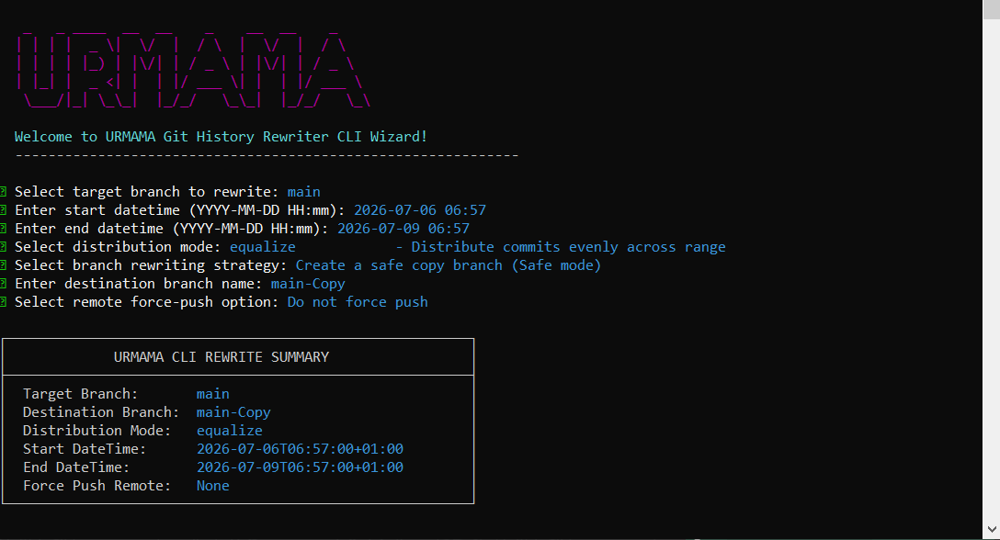

# URMAMA – Git History Rewriter Documentation

```
   _   _ ____  __  __    _    __  __    _   
  | | | |  _ \|  \/  |  / \  |  \/  |  / \  
  | | | | |_) | |\/| | / _ \ | |\/| | / _ \ 
  | |_| |  _ <| |  | |/ ___ \| |  | |/ ___ \
   \___/|_| \_\_|  |_/_/   \_\_|  |_/_/   \_\
```

`urmama` is a powerful Node.js CLI tool that rewrites the commit history of a Git branch so that all commits fit within a specified date range. It preserves commit order, message content, author information, and merge tree structures, and offers three flexible commit distribution algorithms.

[](.docs/urmama-demo.png)

---

## Table of Contents
1. [Installation](#installation)
2. [How it Works](#how-it-works)
3. [Running Modes](#running-modes)
   - [Interactive TUI Wizard](#interactive-tui-wizard)
   - [Non-Interactive CLI](#non-interactive-cli)
4. [Distribution Modes](#distribution-modes)
   - [Randomise (Default)](#randomise-default)
   - [Equalize](#equalize)
   - [GreedyMum](#greedymum)
5. [CLI Arguments Reference](#cli-arguments-reference)
6. [Branch Handling & Safety](#branch-handling--safety)
7. [NPM Release Automation](#npm-release-automation)
8. [Testing & Development](#testing--development)

---

## Installation

You can install `urmama` globally via npm:

```bash
npm install -g urmama
```

Or run it directly using `npx`:

```bash
npx urmama [options]
```

---

## How it Works

`urmama` performs history rewriting using Git plumbing commands (`git commit-tree`). Rather than altering your files in the working directory (which can trigger merge conflicts and slow down operations), `urmama` operates directly inside Git's object database:
1. It collects all commits from the root commit to HEAD in chronological order.
2. It calculates new author and committer dates for each commit according to your chosen distribution algorithm.
3. It constructs a new commit history branch referencing the original commit trees while linking them to their newly rewritten parents and timestamps.
4. It updates the target or destination branch reference to the new rewritten HEAD.

This plumbing-based approach ensures rewriting is **extremely fast**, **100% conflict-free**, and **fully preserves merges and branch structure**.

---

## Running Modes

### Interactive TUI Wizard
Running `urmama` with no arguments launches a Terminal User Interface (TUI):

```bash
urmama
```

The wizard guides you step-by-step through configuration with interactive keyboard select menus and validation:
- **Target Branch Selection**: Automatically lists local git branches.
- **Datetime Range Prompts**: Input prompts with syntax checking.
- **Distribution Mode Menu**: Selection menu explaining modes.
- **Branching Strategy Options**: Choose safe copy branches or in-place rewrites.
- **Summary Card**: Shows your setup configuration for approval before execution.

### Non-Interactive CLI
For script integrations or CI/CD pipelines, you can run `urmama` with flags:

```bash
urmama \
  --starts "2026-06-01 09:00" \
  --ends "2026-06-03 18:00" \
  --mode "equalize" \
  --targetBranch "main" \
  --destBranch "main-Copy"
```

---

## Distribution Modes

### Randomise (Default)
Distributes commits randomly across all calendar days in the range.
- Partitions the total commits $N$ into $D$ random bucket sizes.
- Ensures all commits remain chronological.
- Commits on the same calendar day are spaced out across the active day window.

### Equalize
Distributes commits evenly across all calendar days in the range.
- Commits are divided into daily buckets: $\text{base} = \lfloor N / D \rfloor$, with the remaining remainder distributed one-by-one to the earliest days.
- Ideal when you want a uniform commit frequency.

### GreedyMum
Leaves commits that are already inside your `[S, E]` date range untouched. Adjusts only the commits falling outside.
- **Buffer Hour Windows**: Reserves a 1-hour window at the start (`[S, S + 1 hour]`) and at the end (`[E - 1 hour, E]`).
- **Commits Before S**: Moved to the first day of the range within the first hour buffer window. Commits originally inside the first hour window are nudged inward (after the first hour) to maintain relative order.
- **Commits After E**: Moved to the last day within the last hour buffer window. Commits originally inside the last hour window are nudged inward (before the last hour) to maintain relative order.
- **Inside Commits**: Commits already inside the range (outside buffer zones) are left completely unchanged (retaining their original author and committer dates).

---

## CLI Arguments Reference

| Flag | Required | Default | Description |
|---|---|---|---|
| `--starts "YYYY-MM-DD HH:mm"` | Yes (CLI mode) | None | Start datetime of the range (inclusive). |
| `--ends "YYYY-MM-DD HH:mm"` | Yes (CLI mode) | None | End datetime of the range (inclusive). |
| `--targetBranch <name>` | No | Active Branch | The branch whose commit history will be rewritten. |
| `--destBranch <name>` | No | `{targetBranch}-Copy` | The branch that will contain the rewritten history. |
| `--useTargetAsDest [true\|false]`| No | `false` | If `true`, rewrites the target branch in-place. |
| `--mode <mode>` | No | `randomise` | Commit distribution strategy: `randomise`, `equalize`, or `greedyMum`. |
| `--forcePushTo <remote>` | No | None | If provided, performs a force push (`git push --force <remote> <branch>`) after rewriting. |

---

## Branch Handling & Safety

To prevent accidental history loss, `urmama` follows these safety guidelines:
1. **Uncommitted Changes Check**: The tool will fail if your git working tree has uncommitted modifications.
2. **Safe Branch Defaults**: By default, `urmama` writes history to a copy branch (e.g. `main-Copy`). If the copy branch already exists, it appends a random ID to prevent overwriting.
3. **Target In-Place Prompts**: When `--useTargetAsDest true` is set, `urmama` prompts you for explicit confirmation.
4. **Backup Creation**: If `--useTargetAsDest true` and `--destBranch <name>` are specified together, `urmama` creates a backup branch of the target branch's current state before performing the rewrite.

---

## NPM Release Automation

The project includes automation tasks using the `Makefile` and `.env` credentials file.

1. **Setup Environment**:
   Initialize `.env` from `.env.example`:
   ```bash
   make env-init
   ```
   Set your `NPM_PUBLISH_KEY` token in `.env`.

2. **Publish Patch release**:
   ```bash
   make push-update
   ```
   This automatically increments the patch version (`npm version patch --no-git-tag-version`) and publishes the package to npm securely.

3. **Publish Minor/Major releases**:
   ```bash
   make publish-update-minor
   make publish-update-major
   ```

---

## Testing & Development

You can run the test suite (both unit tests and integration tests) using:

```bash
make test
```
The test suite validates:
- Calender date formatting, timezone offsets, and rollover checks.
- Spacing mathematics inside time windows.
- Uniform distribution logic of `equalize` and `randomise` modes.
- State machine testing of `greedyMum` moving and nudging logic.
- Integration tests over mock Git repositories.
